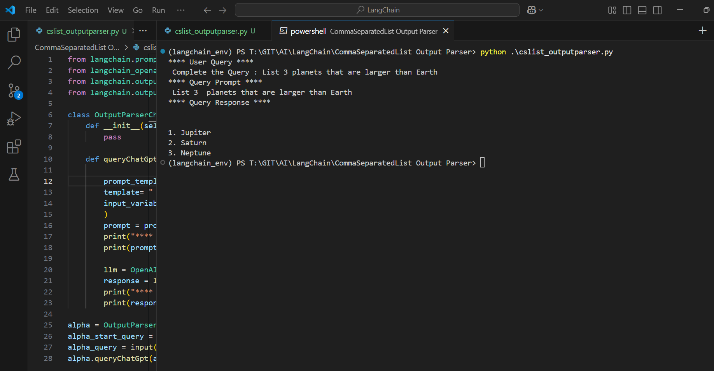

Execute

```py
from langchain.prompts import PromptTemplate
from langchain_openai import OpenAI
from langchain.output_parsers.list import ListOutputParser
from langchain.output_parsers import CommaSeparatedListOutputParser

class OutputParserChatGpt:
    def __init__(self):
        pass

    def queryChatGpt(self,start_query,query):

        prompt_template = PromptTemplate(
        template= " {start_query} {query}",
        input_variables=["start_query","query"]
        )
        prompt = prompt_template.format(query=query,start_query=start_query)
        print("**** Query Prompt ****")
        print(prompt)

        llm = OpenAI()
        response = llm.invoke(prompt)
        print("**** Query Response ****")
        print(response)

alpha = OutputParserChatGpt()
alpha_start_query = "List 3 "
alpha_query = input(f"**** User Query ****\n Complete the Query : {alpha_start_query}")
alpha.queryChatGpt(alpha_start_query,alpha_query)

```

Outcome
