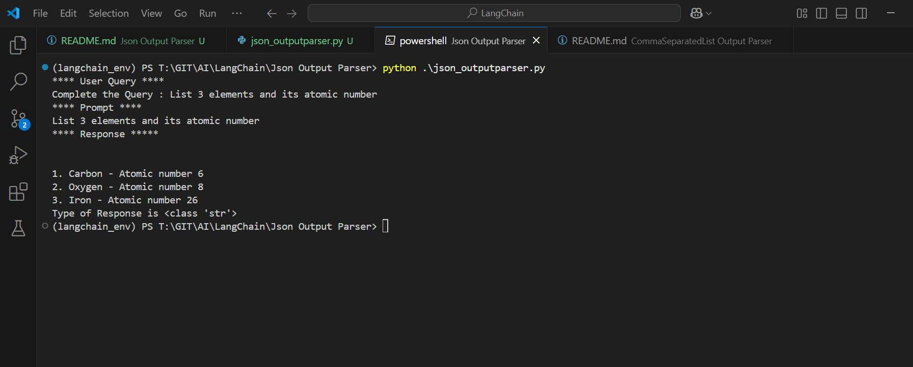
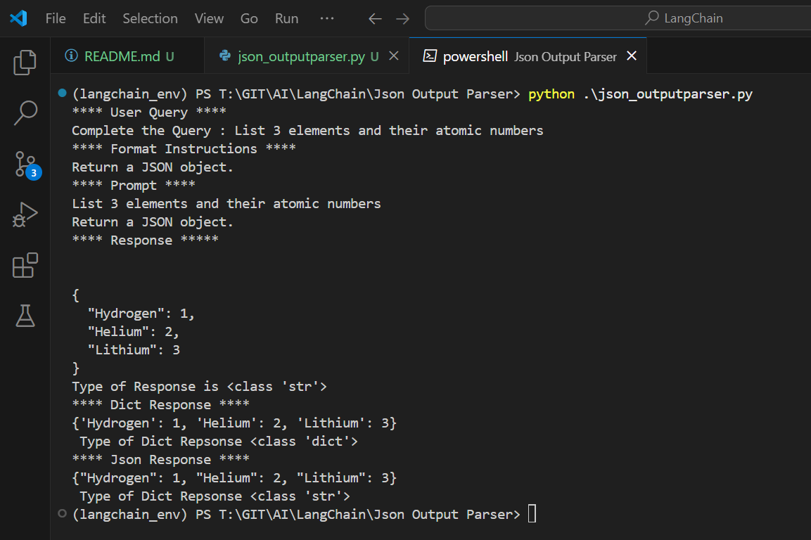

Execute One

```py
from langchain_openai import OpenAI

from langchain.prompts import PromptTemplate
from langchain_core.output_parsers import JsonOutputParser
import json

class JsonParserGpt:
    def __init__(self):
        pass


    def querychatgpt(self,input_prequery,inupt_query):
        
        promt_template = PromptTemplate(
            template="{inputprequery} {inuptquery}",
            input_variables=["inputprequery","inuptquery"]
        )

        prompt = promt_template.format(inputprequery = input_prequery ,inuptquery= inupt_query )
        print("**** Prompt ****")
        print(prompt)

        llm = OpenAI()
        response = llm.invoke(prompt)
        print("**** Response *****")
        print(response)
        print(f"Type of Response is {type(response)}")


kiwi = JsonParserGpt()
prequery = "List 3"
inputquery = input(f"**** User Query ****\nComplete the Query : {prequery} ")
kiwi.querychatgpt(prequery,inputquery)

```

Outcome



Execute Two
```py
from langchain_openai import OpenAI

from langchain.prompts import PromptTemplate
from langchain_core.output_parsers import JsonOutputParser
import json

class JsonParserGpt:
    def __init__(self):
        pass


    def querychatgpt(self,input_prequery,inupt_query):
        
        promt_template = PromptTemplate(
            template="{inputprequery} {inuptquery}",
            input_variables=["inputprequery","inuptquery"]
        )

        prompt = promt_template.format(inputprequery = input_prequery ,inuptquery= inupt_query )
        print("**** Prompt ****")
        print(prompt)

        llm = OpenAI()
        response = llm.invoke(prompt)
        print("**** Response *****")
        print(response)
        print(f"Type of Response is {type(response)}")
    
    def querychatgptJsonResponse(self,input_prequery,inupt_query):
        
        output_parser = JsonOutputParser()
        format_ins = output_parser.get_format_instructions()
        print("**** Format Instructions ****")
        print(format_ins)

        promt_template = PromptTemplate(
            template="{inputprequery} {inuptquery}\n{format_instructions}",
            input_variables=["inputprequery","inuptquery"],
            partial_variables={"format_instructions":format_ins}
        )

        prompt = promt_template.format(inputprequery = input_prequery ,inuptquery= inupt_query )
        print("**** Prompt ****")
        print(prompt)

        llm = OpenAI()
        response = llm.invoke(prompt)
        print("**** Response *****")
        print(response)
        print(f"Type of Response is {type(response)}")

        dict_response = output_parser.parse(response)
        print("**** Dict Response ****")
        print(dict_response)
        print(f" Type of Dict Repsonse {type(dict_response)}")
        
        json_response = json.dumps(dict_response)
        print("**** Json Response ****")
        print(json_response)
        print(f" Type of Dict Repsonse {type(json_response)}")
        


# kiwi = JsonParserGpt()
# prequery = "List 3"
# inputquery = input(f"**** User Query ****\nComplete the Query : {prequery} ")
# kiwi.querychatgpt(prequery,inputquery)

parrot = JsonParserGpt()
prequery = "List 3"
inputquery = input(f"**** User Query ****\nComplete the Query : {prequery} ")
parrot.querychatgptJsonResponse(prequery,inputquery)
```

Outcome
